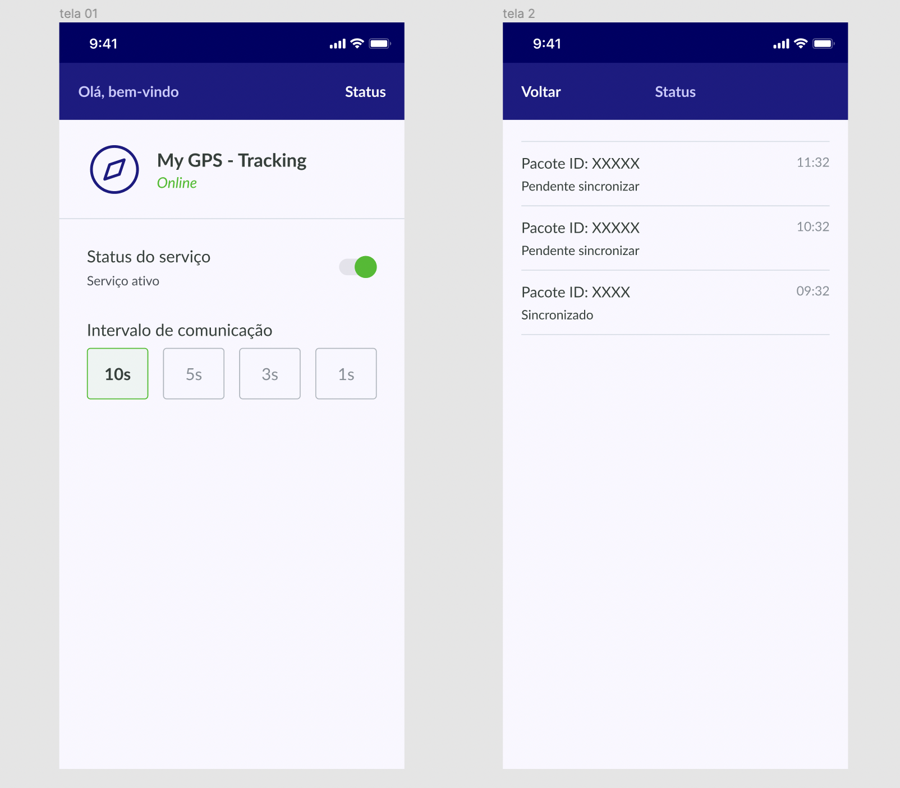

<p align="center">
  

  
  
  <a href="https://github.com/caiopratali/mygps-react-native/commits/master">
    
  </a>
    
   


<h1 align="center">MyGPS - Tracking</h1>

<p align="center">Application developed with React Native and Redux, which sends location at each selected time interval.</p>

<p align="center">
 <a href="#objetivo">Objetivo</a> •
 <a href="#roadmap">Roadmap</a> • 
 <a href="#tecnologias">Tecnologias</a> • 
 <a href="#contribuicao">Contribuição</a> • 
 <a href="#licenc-a">Licença</a> • 
 <a href="#autor">Autor</a>
</p>

<h1 align="center">
  
</h1>

### Pré-requisitos

Antes de começar, você vai precisar ter instalado em sua máquina as seguintes ferramentas:
[Git](https://git-scm.com), [Node.js](https://nodejs.org/en/), [docker](), [docker-compose](). 
Além disto é bom ter um editor para trabalhar com o código como [VSCode](https://code.visualstudio.com/)

### 🎲 Rodando o Back End (servidor)

```bash
$ git clone https://github.com/contele/cntl-test.git
```
```bash
$ cd cntl-test/react-native
```
```bash
$ npm install
```
```bash
$ docker-compose up --build
```
Para acessar a documentação dos endpoints, basta acessar a URL: http://localhost:8081/doc

<p align="center">
  <a href="https://github.com/caiopratali/mygps-react-native/assets/images/telas.png" target="_blank"></a>
</p>


### 🧭 Rodando a aplicação web (Frontend)

```bash
$ git clone https://github.com/caiopratali/mygps-react-native.git
```
```bash
$ cd mygps-react-native
```
Abra o projeto no seu editor de texto favorito e altere o arquivo .env da raiz do projeto.
```js
// Se não funcionar com localhost altere para o seu ip.

API_URL="http://localhost:8081/points/"
```
```bash
$ yarn add
```
```bash
$ yarn start --port=8082
```
```bash
$ yarn android --port=8082
```


### 🛠 Tecnologias

As seguintes ferramentas foram usadas na construção do projeto:

- [Node.js](https://nodejs.org/en/)
- [React](https://pt-br.reactjs.org/)
- [React Native](https://reactnative.dev/)
- [TypeScript](https://www.typescriptlang.org/)
- [Redux](https://expo.io/)